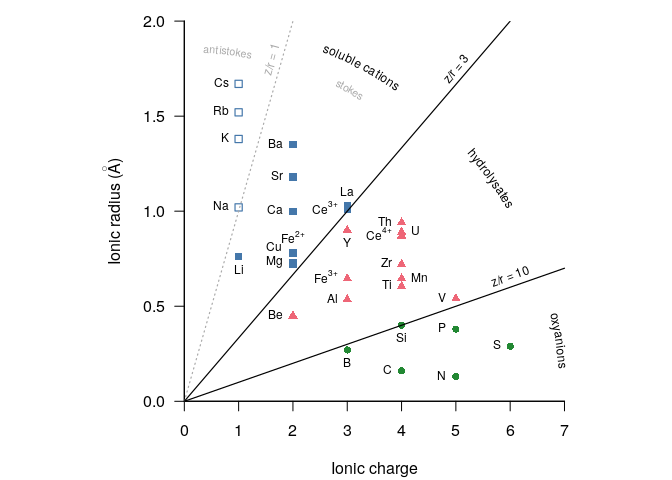

<!-- README.md is generated from README.Rmd. Please edit that file -->
Goldschmidt diagram
===================

Plot Goldschmidt (1934, 1945) diagram with R using `graphics` and `plotrix`.

Usage
-----

``` r
source("goldschmidt.R")
```


